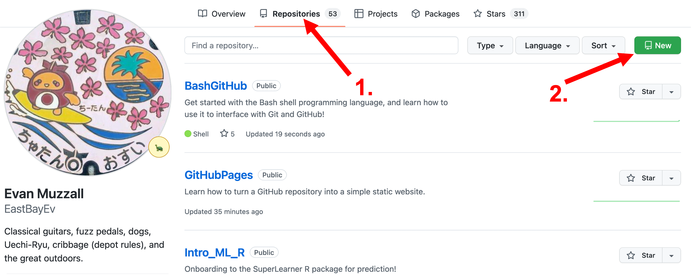
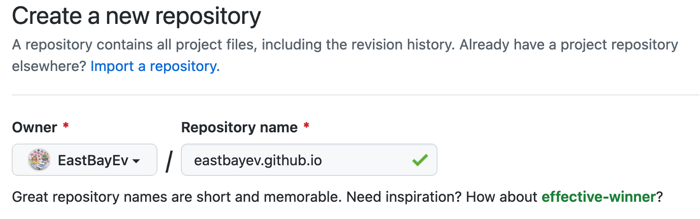
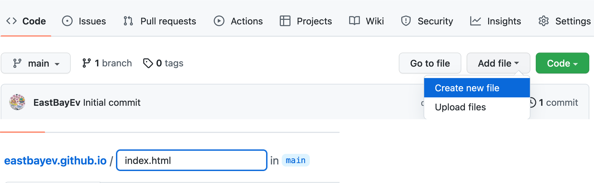
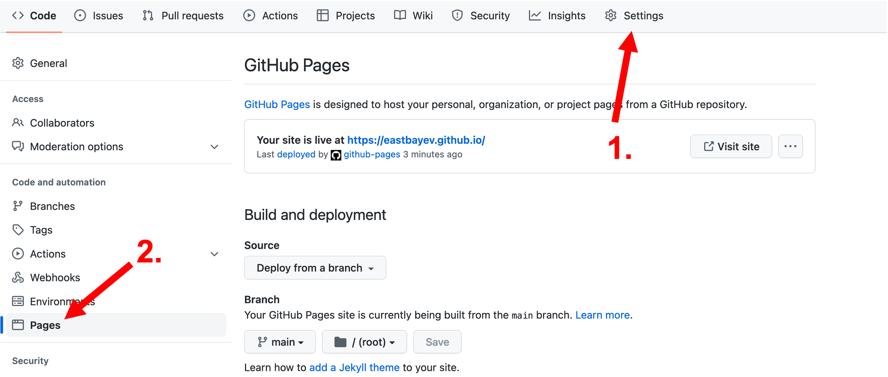
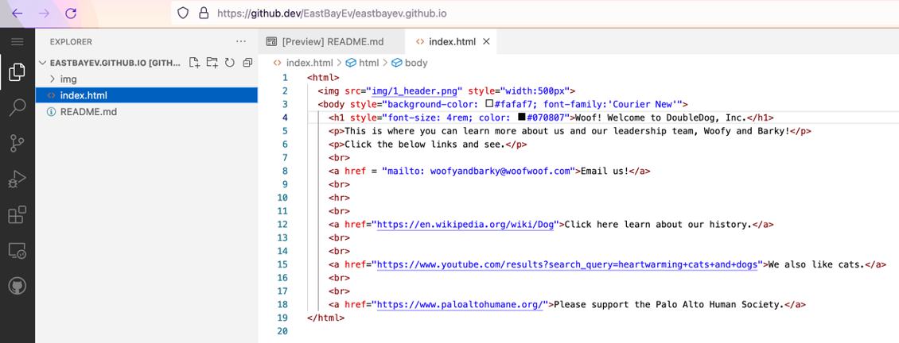
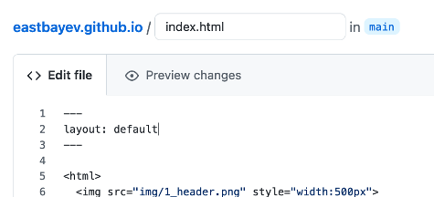

## This workshop is divided into 10 steps to build your own website and two challenges

GitHub Pages allows you to build simple static websites for free!

1. `gitclone` the workshop materials
2. Login to your GitHub account
3. Create a new repository
4. Create `index.html`
5. Configure the publishing source
6. Copy/paste the `img` folder from the workshop materials
7. Edit `index.html`
8. Usage limits
9. Open the web-based editor
10. Set a theme
Challenge 1: Learn some HTML and CSS
Challenge 2: Read the docs

****

## 1. `gitclone` the workshop materials

https://github.com/EastBayEv/GitHubPages

****

## 2. Login to your GitHub account

Create one here if you have not done so already: https://github.com/signup?ref_cta=Sign+up&ref_loc=header+logged+out&ref_page=%2F&source=header-home

****

## 3. Create a new repository

1. From your profile page, click "Repositories".

2. Then, click "New".



3. Name it `yourusername.github.io-test`

Replace `yourusername` with your user name!

Select the button to make the visibility "Public", check the box to "Add a README file", and click the green "Create Repository" button at the very bottom.



> Note: your website could simply be `yourusername.github.io` (the -test part isn't needed, or could be -somethingelse!

****

## 4. Create `index.html`

1. On your repository page, click "Add File" then "Create new file".

2. On the next screen, name it `index.html`. This file contains information about how your site should be displayed.

3. Scroll down and click the green "Commit new file" button.



****

## 5. Configure the publishing source

Click "Settings", then "Pages" from the left sidebar.

In this example, we want to "Deploy from a branch" and select the "main" branch to be deployed for the site.



****

## 6. Copy/paste the `img` folder from the workshop materials

Copy/paste the "img" folder from the workshop materials into your repository through which ever method you choose.

Then, add, commit, and push it to your repository.

****

## 7. Edit `index.html`

Let's add some things to `index.html` to start customizing your site!

Return to your repository page and click the file `index.html`, and then click the pencil icon to edit it.

Copy/paste the below code into your file, and scroll down and click the green "Commit changes" button.

Wait a few minutes and see your changes!

[Click here to choose html/hex colors.](https://www.google.com/search?client=firefox-b-1-d&q=html+color+picker)

```
<html>
  
  <body style="background-color: #fafaf7; font-family:'Courier New'">
    <h1 style="font-size: 4rem; color: #070807">Woof! Welcome to DoubleDog, Inc.</h1>
    <p>This is where you can learn more about us and our leadership team, Woofy and Barky!</p>
    <p>Click the below links and see.</p>
    <br>
    <a href = "mailto:woofyandbarky@woofwoof.com">Email us!</a>
    <br>
    <hr>
    <br>                                                                                                        
    <a href="https://en.wikipedia.org/wiki/Dog">Click here learn about our history.</a>
    <br>
    <br>
    <a href="https://www.youtube.com/results?search_query=heartwarming+cats+and+dogs">We also like cats.</a>
    <br>
    <br>
    <a href="https://www.paloaltohumane.org/">Please support the Palo Alto Human Society.</a>
</html>
```

****

## 8. Usage limits

Know that you are limited to 10 builds (added/committed/pushed changes) per hour. [Click here to read the terms of use.](https://docs.github.com/en/pages/getting-started-with-github-pages/about-github-pages#limits-on-use-of-github-pages)

****

## 9. Open the web-based editor

Point your browser to your repository, and simply press the period `.` key.

This will open the editor, where you can experiment with changes before adding, committing, and pushing.

Click the three horizontal bars in the upper left corn and select "Go to repository" to return to the repo page.



[Read the documentation for the GitHub web-based editor.](https://docs.github.com/en/codespaces/the-githubdev-web-based-editor)

****

## 10. Set a theme

1. Add a file named `_config.yml` to your repo.

2. [Browse stock themes.](https://pages.github.com/themes/)

3. Copy paste the text from the "Usage" section of a stock theme into this file. For example, for the "Architect" theme: https://github.com/pages-themes/architect#usage

```
remote_theme: pages-themes/architect@v0.2.0
plugins:
- jekyll-remote-theme # add this line to the plugins list if you already have one
```

4. Add yaml front matter to your `index.html` file (or any other page you create)

```
---
layout: default
---
```



[Read the Jekyll docs. Jekyll is kind of tough with tons of dependencies, good luck!](https://docs.github.com/en/pages/setting-up-a-github-pages-site-with-jekyll/about-github-pages-and-jekyll)

You can find many more canned themes by searching the web.

### Remove the website header

You can remove the header completely by creating a new file named `assets/css/style.scss` and copy/pasting the below code

```
---
---

@import "{{ site.theme }}";

header {
  display: none;
}
```

### Rename the tab title

Change the name that shows in a web browser tab by adding the below code to `_config.yml`.

> If you keep the header, you can add a title in the `title` field. Or, set it to `null` to leave it blank. 

```
`name: Test site`
`title: null`
```

****

## Challenge 1: Learn some HTML and CSS!

What if you want to create your own theme? Learn HTML and CSS!

* [HTML For Beginners The Easy Way: Start Learning HTML & CSS Today](https://html.com/)
* [W3 School HTML Tutorial](https://www.w3schools.com/html/)

****

## Challenge 2: Read the docs

Edit your README file to better explain your site, include resources, how-to's, and other

[Read the GitHub documentation.](https://docs.github.com/en/pages/getting-started-with-github-pages/about-github-pages)
